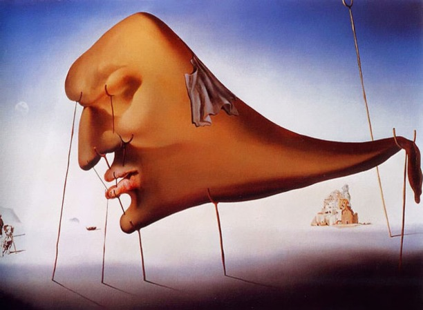
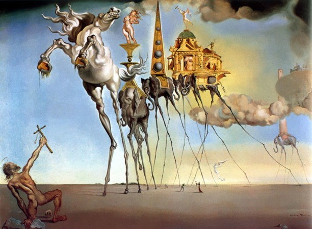
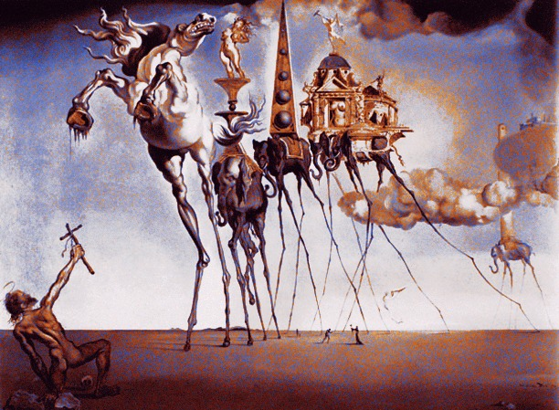

# Introdução do projeto

O objetivo deste trabalho é a implementação de um algoritmo para a resolução de um “quebra-cabeça digital”. Imagine que você tem duas imagens coloridas: as imagens não precisam ter necessariamente o mesmo tamanho, mas precisam ter a mesma área, ou seja, a mesma quantidade de pontos (pixels).

Imagem 1 | Imagem 2
----------------------- | ---------------------
  | 
(a) Origem: Sleep (Salvador Dali, 1937) |   (b) Desejada: The Temptation of St. Anthony (Salvador Dali, 1946) 

O algoritmo deverá reposicionar os pixels da primeira imagem (origem) para produzir uma nova imagem que seja o mais parecida possível com a segunda (desejada). O detalhe é que cada pixel da imagem de origem só pode ser utilizado exatamente uma vez, ou seja, é como se fosse um gigantesco quebra cabeça, onde o objetivo é colocar os pixels em uma determinada ordem.

Por exemplo, considerando as imagens da figura acima, uma possível imagem de saída seria:




## Operação do programa

As seguintes teclas estão disponíveis na aplicação:

- 1: Exibe a imagem original
- 2: Exibe a imagem desejada
- 3: Exibe a imagem de saída do algoritmo
- v: Verifica se todos os pixels da imagem destino foram utilizados na resultante - caso este teste falhe, há algo errado na implementação do algoritmo.
- ESC: finaliza a execução

## Execução

```shell
make
./transition dali2.jpg dali1.jpg 
```